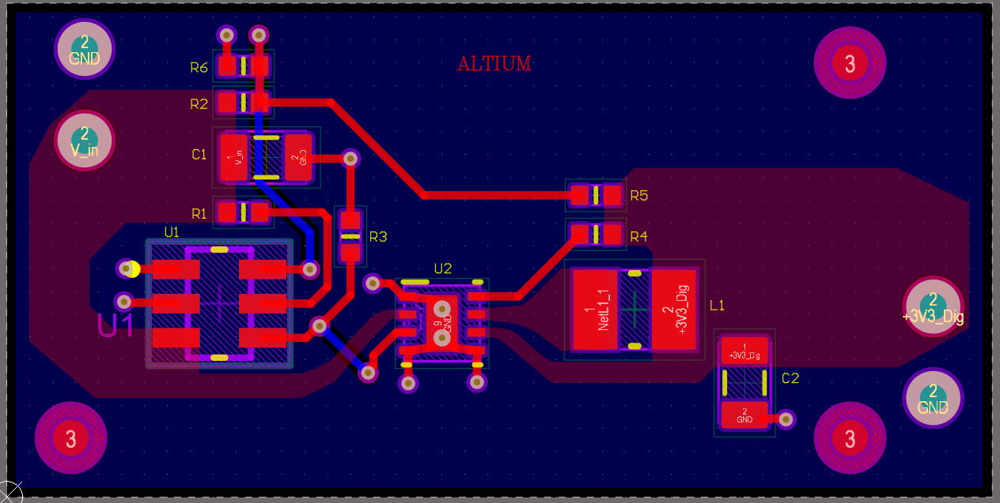

---

## 📐 Project Description

This project is a **Push Button Power Controller** circuit, which toggles the power output using a push button. It's commonly used in microcontroller-based systems or low-power devices.

**Main Features:**
- Toggle power ON/OFF with a single push button
- Debounced signal handling
- Simple and compact PCB layout

---

## 🧾 Contents

### 🔧 AltiumProject/
- `Sheet1.SchDoc`: Main schematic
- `PCB1.PcbDoc`: PCB layout
- `dummy_dummy.PrjPCB`: Altium project file
- `output.OutJob`: Output job configuration

### 📤 OutputFiles/
- **Gerber/**: Standard Gerber files for PCB fabrication
- **NC Drill/**: Drill files
- **Pick Place/**: Component placement files
- **BOM/**: Bill of Materials in CSV
- **Report Board Stack/**: Stackup reports
- **Status Report.txt**: Summary of board status

### 📄 PDFs/
- `Schematic.pdf`: PDF of the schematic for easy viewing
- `PCB_Layout_Top_Bottom.pdf`: Board layout (top and bottom layers)
- `BOM.pdf`: Bill of Materials in PDF format

---

## 📦 How to Use

1. Open the `AltiumProject/` folder in **Altium Designer** to view or modify the design.
2. Use the files in `OutputFiles/` for fabrication and assembly.
3. View the schematic, PCB layout, and BOM directly from the `PDFs/` folder if you don't have Altium.

---

## 🧠 License

This project is open for educational and non-commercial use. Please give credit if you use or modify the design.

---

## 🙌 Acknowledgments

Created as part of the **Altium Designer learning course** by [Sreerag S].

